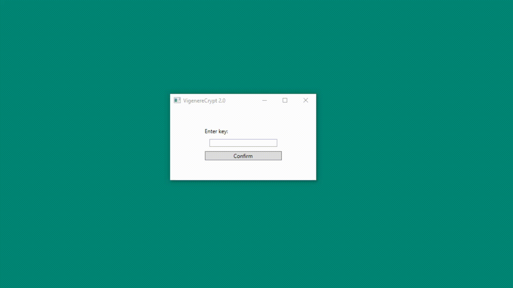

# VigenereCrypt
Implementing vingenere crypt in sub UTF-8 environment

This is a project for my university.
It's very basic and I used it to get familiar with C#, no black magic here :)

It implements <a href=https://en.wikipedia.org/wiki/Vigen%C3%A8re_cipher>Vigenère cipher</a>.  
The twist is that it also implements Polish letters like ą, ę, ż, ź, ć and a solid chunk of latin-european languages.

